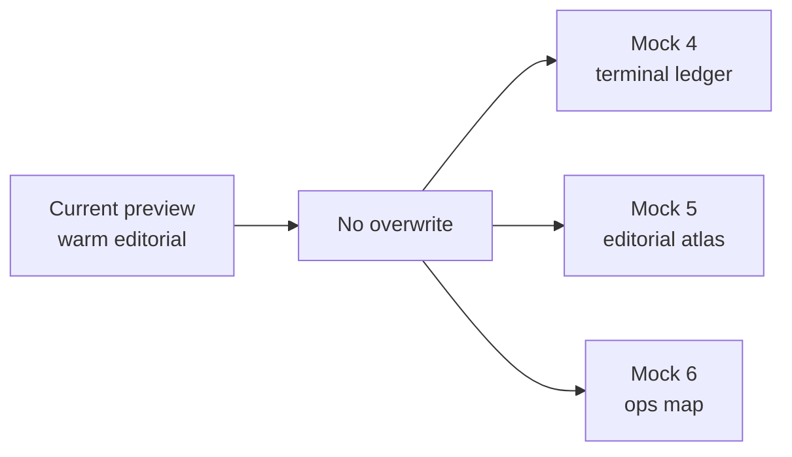
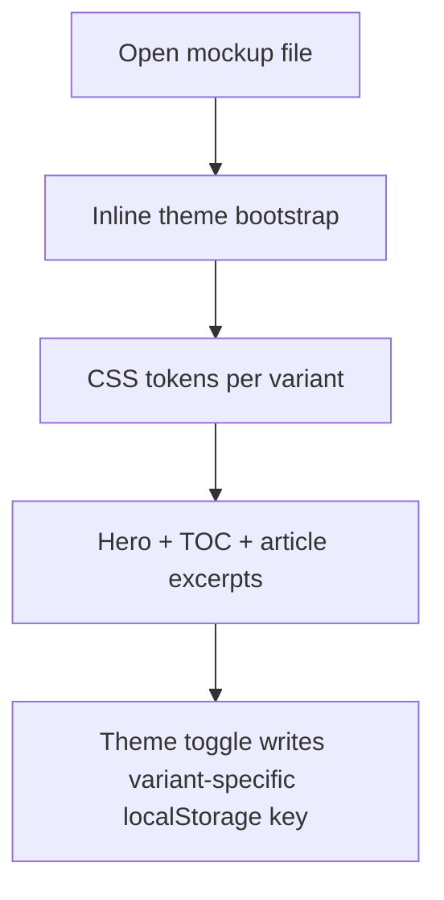
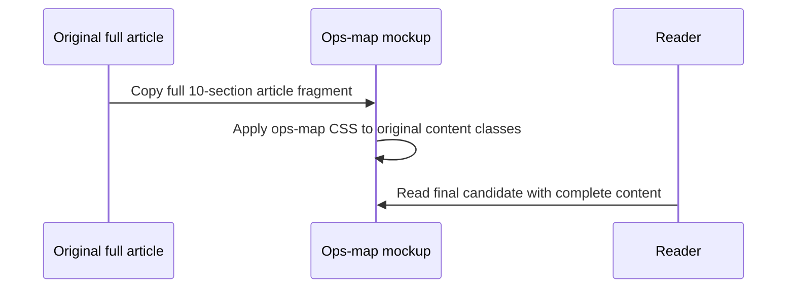

# Three Ways to Read a Planning System

**Date:** 2026-05-01

---

The original `/ck:plan --deep --tdd` preview already had a polished editorial treatment, but choosing a final article style from one finished page is hard. The practical need was comparison: keep the current page untouched, then add a few sharply different directions beside it so the article can be judged by mood, density, and reading rhythm.

---

## What It Brings

The preview folder now has three additional standalone mockups. Each one keeps the same article premise, but changes the visual contract: terminal ledger, editorial atlas, and operations map.



| Before | After |
|---|---|
| One main preview style to evaluate | Three extra directions in `mockups/` |
| Hard to compare dense vs airy layouts | Each mockup makes a different density choice |
| Risk of losing the current styling | Original file remains untouched |

---

## How It Works

The implementation is intentionally static. Each mockup is a self-contained HTML file with its own CSS variables, font stack, responsive layout, and local theme key.



The key pattern is that each theme uses an isolated storage key, so toggling one mockup does not affect the original page or the other versions:

```html
<script>
  (function () {
    var stored = localStorage.getItem('ck-plan-terminal-ledger-theme');
    document.documentElement.dataset.theme = stored || 'dark';
  })();
</script>
```

The three variants also share the same safety rule: they summarize the article structure for fast design comparison instead of replacing the full 6k-line article page.

---

## Challenges Encountered

The main constraint was preserving the existing preview. The new files were added under `sites/inside-claudekit/assets/previews/mockups/` and numbered after the existing `mock-1` through `mock-3` files.

Another small HTML detail was escaping Google Fonts query strings. The font URLs now use `&amp;` inside `href` attributes:

```html
<link href="https://fonts.googleapis.com/css2?family=Azeret+Mono:wght@400;500;600;700&amp;family=Noto+Serif:ital,wght@0,400;0,600;1,400&amp;display=swap&amp;subset=vietnamese" rel="stylesheet" />
```

Inline JavaScript was checked separately with Node by extracting every `<script>` block and compiling it with `new Function(...)`.

---

## Files

| File | What |
|---|---|
| `sites/inside-claudekit/assets/previews/mockups/ck-plan-tdd-deep-modes-mock-4-terminal-ledger.html` | Dense terminal-style variant with grid background and command-led article framing |
| `sites/inside-claudekit/assets/previews/mockups/ck-plan-tdd-deep-modes-mock-5-editorial-atlas.html` | Airier magazine/editorial variant with serif hierarchy and marginal navigation |
| `sites/inside-claudekit/assets/previews/mockups/ck-plan-tdd-deep-modes-mock-6-ops-map.html` | Selected operations-map variant, expanded from preview excerpt to the full 10-section article |

---

## Update: Ops Map Goes Full-Length

After comparing the variants, the operations-map direction was selected. The short mockup was replaced with the complete article body from the original preview, while keeping the ops-map visual system: dark operational surface, Chakra Petch headings, sticky TOC, scroll-spy, risk panels, code blocks, and isolated theme persistence.



---

## Takeaway

For article design, a few isolated style prototypes are more useful than one overworked final draft. Keeping each direction as a standalone file makes comparison cheap, protects the current preview, and leaves a clear path to either promote one style or combine the strongest pieces later.
