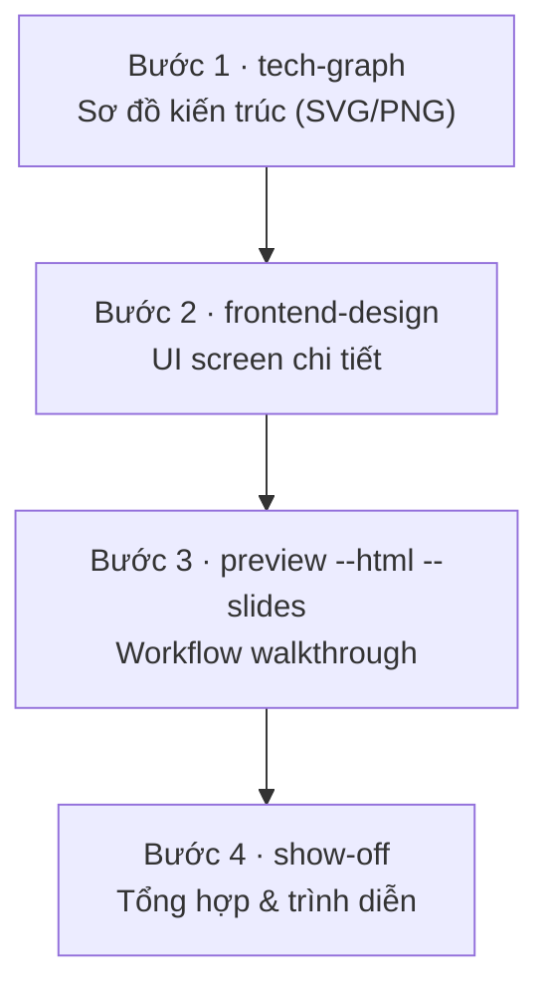

# Bộ công cụ trực quan hóa của ClaudeKit

Khi yêu cầu Claude dựng một trang HTML, chất lượng thường không nằm ở câu "làm đẹp hơn" mà nằm ở skill được gọi. ClaudeKit không gom trực quan hóa vào một lệnh vạn năng. Nó tách thành nhiều skill nhỏ, mỗi skill xử lý một việc khá hẹp. Lẫn lộn phổ biến nhất là xem tất cả như cùng một nhóm, rồi nhận về tài liệu kiến trúc trông như landing page, hoặc UI sản phẩm lại giống tài liệu nội bộ.

Bài này dựng một **bản đồ định vị** quanh hai trục *tư duy điều phối* và *thực thi giao diện*, rồi áp vào một bài toán thật: visual hóa trọn một plan file. Phần 03 chạy thật trên plan mẫu của app duyệt chi phí, screenshot giữ nguyên làm bằng chứng; prompt trong bài copy-paste dùng lại được.

Một lưu ý để đọc đúng ví dụ: trong ClaudeKit, `preview`, `frontend-design`, `stitch`, `tech-graph`, `show-off` đều là **skill gọi bằng ngôn ngữ tự nhiên** (prompt-driven), không phải lệnh CLI có flag để gõ tay. Khi bài nhắc tới flag, đó là flag của *script nội bộ* mà skill tự chạy bên dưới, không phải tham số gõ kèm slash command (lệnh dạng `/ck:...`). Ngoại lệ duy nhất là các flag generation của `preview` (`--explain`, `--diagram`, `--slides`, `--html`...), vì chúng là một phần cú pháp gọi skill này.

---

## 01 · Bản đồ định vị: `/ck:preview` vs `/ck:frontend-design`

Hai skill này hay bị lẫn vì đều có thể xuất ra HTML đẹp, đều quan tâm typography và màu sắc, đều có rule chống rập khuôn. Khác biệt nằm ở contract. Cách phân biệt nhanh là nhìn mục đích của output: phục vụ tư duy, hay phục vụ sản phẩm.

**`/ck:preview`: điều phối trực quan, phục vụ tư duy.** Skill này dùng khi cần xem trước file/thư mục, hoặc dựng một tài liệu giải thích trực quan ngay sau `/ck:plan` hay `/ck:debug`. Nó giống một trạm trung chuyển: nhận topic hoặc bối cảnh git, rồi sinh explanation, slides, diagram, hoặc dashboard review. Người xem chính là developer và team.

```
/ck:preview --html --explain "i18n pipeline của blog: từ HTML source qua JSON tới 4 locale route"
/ck:preview --html --slides "kiến trúc monorepo Astro + Turborepo"
/ck:preview --diff HEAD~3
```

Triết lý style của `preview` là *nhất quán*. Output bị khóa trong một bộ preset tuyển sẵn, chỉ xoay vòng giữa các lần generate để tránh lặp font và palette. Có hai bộ preset riêng: trang HTML cuộn dùng 6 preset (Blueprint, Editorial, Paper-Ink, Terminal Mono, Swiss Clean, Warm Signal), còn slide deck dùng 4 preset khác (Midnight Editorial, Warm Signal, Terminal Mono, Swiss Clean). Một rule cứng đi kèm: mọi trang HTML nó sinh ra phải có **theme toggle** light/dark, là first child của `<body>`. Thiếu toggle thì chưa xong.

**`/ck:frontend-design`: thực thi giao diện, phục vụ sản phẩm.** Skill này dùng khi mục tiêu là tạo UI hoàn thiện cho end user. Nó làm tốt nhất khi có thiết kế nguồn như screenshot, video luồng mẫu, hoặc mô tả chi tiết. Phần kiểm soát thẩm mỹ chặt hơn, vì output được xem như một UI sản phẩm chứ không phải tài liệu nội bộ.

```
/ck:frontend-design Replicate UI trong screenshot này bằng HTML/Tailwind  [+ đính kèm ảnh]
/ck:frontend-design Dashboard quản lý đơn hàng, dải dữ liệu dày. DESIGN_VARIANCE=4, VISUAL_DENSITY=8
```

Triết lý style của `frontend-design` đi hướng ngược lại: *khác biệt*. Mặc định `DESIGN_VARIANCE=8`, với mục tiêu không để hai design giống nhau. Có ba **Design Dials** khai báo ngay trong prompt để điều khiển:

| Dial | Mặc định | Thấp | Cao |
|------|----------|------|-----|
| `DESIGN_VARIANCE` | 8 | Đối xứng, căn giữa | Bất đối xứng, masonry, vùng trống có chủ đích |
| `MOTION_INTENSITY` | 6 | Chỉ hover/active | Scroll reveal, spring physics |
| `VISUAL_DENSITY` | 4 | Whitespace rộng, sạch | Padding nhỏ, số liệu monospace, kiểu cockpit |

### Bảng routing nhanh

| Input | Gọi | Vì |
|-------------|-----|-----|
| Một topic cần giải thích cho team | `preview --html --explain "<topic>"` | Output là tài liệu đọc, có Mermaid |
| Một topic cần present | `preview --html --slides "<topic>"` | Slide engine viewport-fit |
| Một range git / PR | `preview --diff <ref>` | Dashboard review, đọc dữ liệu git thật |
| Một plan cần đối chiếu code | `preview --plan-review <plan>` | So plan với codebase thực tế |
| Screenshot/video một UI | `frontend-design` + đính kèm | Workflow replicate |
| Mô tả một UI + Design Dials | `frontend-design` | Build production UI |

Hai skill không loại trừ nhau. Chúng nằm ở hai giai đoạn khác nhau trong cùng một vòng phát triển: `preview` kiểm tra phần tư duy, ví dụ plan có khớp codebase không, flow đã rõ chưa, diff có blast radius thế nào. `frontend-design` build và kiểm tra phần aesthetic của sản phẩm.

---

## 02 · Hệ kỹ năng vệ tinh

Hai trục chính ở Phần 01 không đứng riêng lẻ. Quanh chúng là một nhóm skill bổ trợ, chia theo ba nhóm năng lực. Nắm được nhóm này giúp gọi đúng skill hơn, và cũng dễ debug khi có thứ không chạy.

### Nhóm 1: Trí tuệ thiết kế

**`/ck:ui-ux-pro-max`** là design intelligence engine. Đây là nền tảng bắt buộc của `frontend-design`, vì mọi workflow đều kích hoạt nó trước, và cũng được khuyến nghị cho `preview --slides`. Bên dưới là search engine BM25 trên bộ CSV lớn: nhiều style, hàng trăm color palette, font pairing, product type, UX guideline, chart type. Nó định hình hệ token thiết kế như layout, typography, spacing trước khi sinh code.

Rule ưu tiên cần nhớ: khi khuyến nghị của `ui-ux-pro-max` va với anti-slop rules, ví dụ gợi ý Inter font hoặc palette tím, **anti-slop rules thắng**, trừ khi user yêu cầu rõ.

### Nhóm 2: Sơ đồ hóa kiến trúc

**`/ck:tech-graph`** dùng để xuất bản diagram chất lượng publish. Skill này tạo SVG và PNG sắc nét để chèn vào bài viết, slide, hoặc hồ sơ bàn giao. Nó hỗ trợ 8 phong cách: *Flat Icon* (mặc định), *Dark Terminal*, *Blueprint*, *Notion Clean*, *Glassmorphism*, *Claude Official*, *OpenAI Official*, *Dark Luxury*. Cách gọi là mô tả hệ thống và style mong muốn bằng ngôn ngữ tự nhiên. Skill tự chạy script `generate-diagram.sh` bên dưới để validate SVG và export PNG.

**`/ck:mermaidjs-v11`** là validator syntax cho sơ đồ dạng văn bản. Nó phù hợp để dựng nhanh flowchart, sequence, state diagram nhúng thẳng vào markdown nội bộ, đồng thời bảo đảm đúng syntax Mermaid v11. `preview` gọi skill này mỗi khi sinh Mermaid. Đây là skill thuần reference, nên cũng có thể dùng độc lập.

Ranh giới ba skill diagram khá rõ: diagram là **file ảnh độc lập** đem đi nơi khác thì dùng `tech-graph`; diagram **nhúng trong markdown** thì dùng `mermaidjs-v11`; diagram sống **bên trong một trang giải thích HTML** thì dùng `preview --diagram`.

### Nhóm 3: Trình chiếu và trải nghiệm

**`/ck:markdown-novel-viewer`** là server đứng sau `preview` view mode. Nó render markdown thành một trang đọc chuyên dụng: serif, nền ấm, bề ngang giới hạn, hợp với tài liệu dài. Điểm dễ bị bỏ qua là nó **render được Mermaid** ngay trong trang đọc, gồm flowchart, sequence, gantt, mindmap..., có theme-aware và toggle full-width. Nhờ vậy có thể đọc plan và xem sơ đồ kiến trúc cùng một chỗ, không chỉ nhìn chữ.

**`/ck:show-off`** là pipeline end-to-end từ brief đến social asset. Điểm hay bị hiểu sai: `show-off` **không** tự quét asset có sẵn trong repo rồi gom thành gallery. Nó chạy một mission self-contained: research/fact-check → viết content song ngữ (VI + EN, mặc định) → kích hoạt `frontend-design` dựng HTML → chạy script Puppeteer chụp screenshot nhiều tỷ lệ → xuất showcase. `frontend-design` chỉ là *một bước* trong đó. Vì vậy nếu muốn `show-off` gộp asset đã dựng từ bước trước, như case study Phần 03, cần đưa asset đó vào mission qua mô tả, đường dẫn, hoặc giữ cùng session. Skill không tự đi tìm. Khi cần cả HTML page, ảnh sẵn sàng đăng và content song ngữ, đây là lựa chọn phù hợp.

---

## 03 · Case study: visual hóa trọn một plan file (chạy thật)

> **Bài toán:** Có một plan file. Mục tiêu là visual hóa toàn bộ: kiến trúc hệ thống + giao diện minh họa + luồng vận hành. Không skill đơn nào xử lý trọn vẹn, vì bài toán bắc qua hai nhóm năng lực tách biệt: *giải thích & sơ đồ* và *UI mockup thật*.

Plan dùng cho case study là app duyệt chi phí nội bộ (expense approval): 6 entity (Employee, ExpenseClaim, LineItem, Approval, Payment, AuditLog), một state machine 5 trạng thái, 5 UI surface. Plan đủ rõ entity + action để các skill suy ra workflow, kiến trúc và UI.

Cần đính chính một điểm để dùng đúng: `preview --explain` và `preview --diagram` nhận một **topic string** (chuỗi mô tả), không tự parse plan file. Thực tế có hai cách làm: mô tả nội dung plan thành topic đủ chi tiết, hoặc đọc plan trong cùng session rồi để Claude tóm tắt thành topic. Cú pháp đúng là flag đứng **trước** topic: `/ck:preview --diagram "<mô tả>"`, không phải `/ck:preview <path> --diagram`.

### Phương án 1: Fast-track (2 lệnh)

*Dành cho lúc cần nghiệm thu nhanh ý tưởng, chấp nhận bản phác thảo.*

```
/ck:preview --html --explain "expense approval app: 5 layer từ SPA xuống PostgreSQL,
  state machine draft→submitted→under_review→approved→paid, 5 surface"

/ck:stitch "tự suy diễn UI screens cho expense approval app từ workflow trong plan;
  liệt kê screen list cho tôi duyệt trước khi gen"
```

- **Lệnh 1** tạo một file HTML tự chứa: overview, ASCII quick view, Mermaid architecture flow, key concepts. Tất cả nằm trong một trang, có theme toggle.
- **Lệnh 2** để `stitch` tự suy diễn cấu trúc màn hình từ logic chức năng trong plan. Cụm "liệt kê screen list trước khi gen" là điểm chặn quan trọng nhất, giải thích ở Phần 04.

### Phương án 2: Comprehensive flow (4 bước)

*Quy trình đầy đủ để tạo bộ hồ sơ thiết kế cho khách hàng hoặc tài liệu dự án. Dưới đây là kết quả chạy thật từng bước.*



#### Bước 1: Sơ đồ kiến trúc với `tech-graph`

```
/ck:tech-graph Sơ đồ kiến trúc expense approval app: 5 layer Frontend (5 screen) →
  API (role-based) → Service (ClaimService owns state machine, Approval, Payment, Audit)
  → Data (PostgreSQL) + Storage (receipts). Style Blueprint.
```

Skill viết SVG theo preset Blueprint: nền dot-grid, mono, accent cyan. Sau đó nó validate và export PNG publish-grade. Kết quả có 5 layer rõ, arrow routing không cắt qua box, state machine callout ở chân, ClaimService được highlight xanh lá vì giữ state machine, AuditService màu cam:


#### Bước 2: Giao diện chi tiết với `frontend-design`

```
/ck:frontend-design Màn hình Approval Queue cho expense approval app (desktop, dev-tool style).
  Sidebar nav + master-detail: danh sách claim chờ duyệt bên trái, chi tiết line item + nút
  approve/reject bên phải. Badge màu theo trạng thái. DESIGN_VARIANCE=4, VISUAL_DENSITY=8
```

Kết quả giữ các anti-slop rule quan trọng: tránh Inter/Roboto, dùng off-black tinted thay vì đen thuần, chỉ một accent gold, layout master-detail thay vì ba card đều nhau, copy có vẻ thật hơn với tên đa dạng và số lẻ tự nhiên như `$1,247.30` thay vì số tròn. Badge `under_review` / `submitted` được mã màu theo state machine:


#### Bước 3: Workflow walkthrough với `preview --html --slides`

```
/ck:preview --html --slides "vòng đời một expense claim: employee tạo & nộp → manager
  duyệt → accountant thanh toán, kèm state machine và 3 guardrail"
```

Deck viewport-fit dùng preset Midnight Editorial: serif, accent gold, dark navy. Style này khác hẳn Blueprint của Bước 1, đúng rule vary aesthetic giữa các output. Deck có progress bar, số trang và theme toggle. Dưới đây là slide title ở dark theme và slide state machine ở light theme, để thấy toggle hoạt động:


#### Bước 4: Tổng hợp & trình diễn với `show-off`

```
/ck:show-off Trang showcase "Expense Approval — bộ hồ sơ trực quan", gộp sơ đồ kiến trúc
  (bước 1), màn hình Approval Queue (bước 2), và slide workflow (bước 3) thành các section
  có nav anchor, mở thẳng browser không cần server.
```

`show-off` là bước tổng hợp cuối. Nó gom diagram và UI screen thành một trang HTML self-contained. Trong case study này, ảnh được nhúng base64 để chỉ cần mở một file là chạy. Trang có nav anchor, footer điểm danh skill đã dùng và theme toggle. Mở thẳng browser, không cần server:


**Chi phí token.** Chuỗi 4 bước tốn token đáng kể, vì mỗi `tech-graph`/`frontend-design`/`preview`/`show-off` là một pass sinh output riêng. Nếu chỉ cần bản đủ dùng để duyệt hướng, quay về Phương án 1.

---

## 04 · Phân biệt kỹ thuật: `/ck:frontend-design` vs `/ck:stitch`

Ở bước dựng UI, tức Bước 2 hoặc lệnh 2 phía trên, điểm quyết định là đã có thiết kế nguồn chưa, hay cần Claude tự suy diễn.

**Sự khác biệt cốt lõi:**

- **`/ck:frontend-design` là tái hiện (replication).** Dùng khi đã có tài sản thiết kế nguồn: bản vẽ Figma, ảnh chụp màn hình mẫu, hoặc một luồng tương tác cụ thể. Skill bám sát nguồn làm chân lý và dựng lại bằng HTML/Tailwind thật.
- **`/ck:stitch` là suy diễn (extrapolation).** Dùng khi *không* có thiết kế mẫu. Skill tự lấp khoảng trống UI bằng cách suy ra bố cục từ logic chức năng, dựa trên "danh từ + động từ" của workflow, ví dụ entity như User/Order và action như create/approve. Plan càng rõ entity và action, screen sinh ra càng sát. Plan mơ hồ thì UI dễ generic và phải sửa nhiều.

| Tình huống | Skill | Bản chất |
|-----------|-------|----------|
| Có screenshot/Figma/mockup để bám | `frontend-design` | Tái hiện chuẩn xác |
| Chỉ có mô tả workflow, tự suy diễn UI | `stitch` | Suy diễn & lắp ghép |

### 3 lưu ý quan trọng khi để AI tự suy diễn giao diện

1. **Chốt danh sách màn hình trước khi gen.** Nên khóa screen list trước. Nếu bỏ qua, AI dễ tự sinh thêm màn hình phụ ngoài phạm vi, vừa tốn token vừa làm loãng luồng chính. Quy trình an toàn: yêu cầu Claude liệt kê screen list dự định → duyệt → rồi mới sinh HTML.
2. **Khai báo Design Dials ngay từ đầu.** Đặt rõ `DESIGN_VARIANCE`, `VISUAL_DENSITY`, `MOTION_INTENSITY` trong lệnh gọi đầu tiên, để AI không tự chọn phong cách lệch nhau giữa các màn hình. UI suy diễn dễ mất đồng bộ nếu mỗi screen tự quyết aesthetic riêng.
3. **Giữ anti-slop guard.** Chặn các pattern nặng mùi AI: font Roboto/Inter mặc định, gradient tím-xanh khuôn mẫu, ba card đều tăm tắp, neon glow, "John Doe" và Lorem Ipsum. `frontend-design` có sẵn checklist 10 điểm cho việc này. `stitch` cần được nhắc lại trong prompt vì nó thiên về tốc độ suy diễn.

Một lưu ý chung cho cả hai: chúng chặn được copy giả như "John Doe", số tròn, cliché, nhưng **copy thật vẫn cần người viết hoặc duyệt**. Skill không tự bịa nội dung domain cho đúng.

---

## 05 · Chuẩn bị và pitfalls

Trước khi chạy chuỗi combine, cần chuẩn bị vài thứ. Các skill này đều thuộc ClaudeKit nên phải được cài. Ngoài ra, mỗi skill có phụ thuộc riêng: `tech-graph` cần binary export SVG/PNG (`rsvg-convert`), `stitch` cần API key/quota của dịch vụ tương ứng, `show-off` cần môi trường chạy Puppeteer để chụp. Thiếu một mảnh, lỗi thường khá mơ hồ. Biết trước sẽ đỡ mất thời gian dò.

Các bẫy hay gặp khi dùng cả hệ:

- Gõ flag cho `show-off`/`tech-graph`/`stitch` như lệnh CLI. Chúng prompt-driven, flag là của script nội bộ.
- Tưởng `show-off` tự quét asset có sẵn. Cần đưa asset vào mission, skill không tự tìm.
- Gọi `preview --diagram <path-to-plan>`. Nó nhận topic string, không đọc file; flag đứng trước topic.
- Để `stitch` tự gen mà chưa chốt screen list. Kết quả dễ thừa màn hình và tốn token.
- Quên rằng preset slide (4) khác preset trang HTML (6). Blueprint/Paper-Ink không có cho slide.
- Dùng `frontend-design` để vẽ tài liệu giải thích. Output thường quá nặng aesthetic cho mục đích đọc.

---

## Tóm lại

| Câu hỏi | Trả lời |
|---------|---------|
| Output phục vụ tư duy hay sản phẩm? | Tư duy → `preview`. Sản phẩm → `frontend-design` |
| Diagram để chèn đi nơi khác hay sống trong trang? | File độc lập → `tech-graph`. Nhúng markdown → `mermaidjs-v11`. Trong trang HTML → `preview --diagram` |
| Dựng UI: có thiết kế nguồn chưa? | Có → `frontend-design` (tái hiện). Chưa → `stitch` (suy diễn) |
| Cần đóng gói showcase song ngữ + screenshot? | `show-off` (pipeline self-contained) |
| Visual hóa trọn plan? | Combine: `tech-graph` + (`frontend-design`/`stitch`) + `preview --slides` + `show-off` |

Mảng trực quan hóa của ClaudeKit không có nút bấm vạn năng, nhưng cũng không rối nếu nhìn theo vai trò. Nó xoay quanh hai trục *điều phối* và *thực thi*. Trước hết xác định ai sẽ xem output và xem để làm gì. Sau đó chọn skill vệ tinh theo dạng output cần. Khi bài toán bắc qua nhiều nhóm năng lực, combine theo đúng thứ tự như case study Phần 03 đã chạy thật, thay vì ép một skill làm việc của skill khác.
